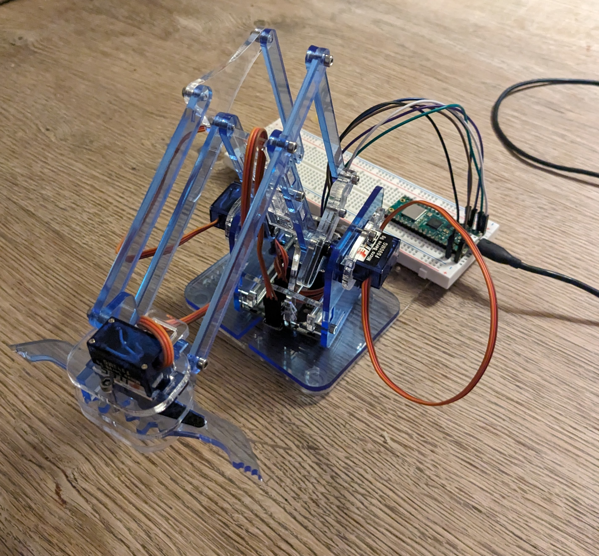
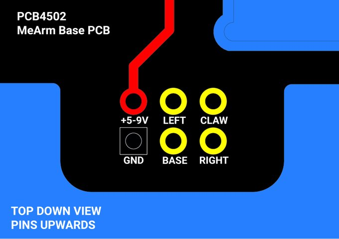
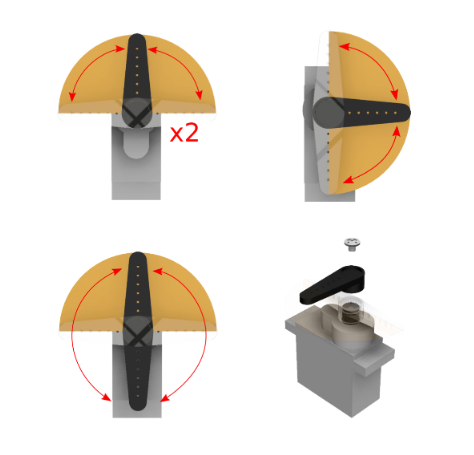

# MeArm MicroPython Controller

**A simple MicroPython module for controling the MeArm**  
[http://learn.mearm.com/](http://learn.mearm.com/) 

  

## Connecting your Micro Controller  

The example below uses a Raspberry Pi PICO-W but any Micro Controller with PWM GPIO pins should work.  

For  the `MeArm` class in [mearm.py](mearm.py), you need to set the pins for each servo  
```python
self.height = Servo({'servo': 'height', 'pin': 0, 'min': 2500, 'max': 6000})
self.reach = Servo({'servo': 'reach', 'pin': 1, 'min': 5200, 'max': 6700})
self.grip = Servo({'servo': 'grip', 'pin': 2, 'min': 4300, 'max': 7600})
self.base = Servo({'servo': 'base', 'pin': 3, 'min': 2600, 'max': 7000})
```  

The MeArm controller board includes a 6 pin ribbon connector. 4 pins for the servos and 5v PWR and GND  

  

The following table shows the PICO-W pins to MeArm board  

| PICO  | MrArm Board |
| ------------- | ------------- |
| 5V (Pin 40)  | +5-9V  |
| GND (Pin 39)   | GND  |
| GP0 (Pin 1) | LEFT |
| GP1 (Pin 2) | RIGHT |
| GP2 (Pin 4) | CLAW |
| GP3 (Pin 5) | BASE |

  

## Calibrating your servos  

For setting the arms (horns) on your servos, follow the guide for your MeArm model in [http://learn.mearm.com/](http://learn.mearm.com/) 

  

In the [calibrate.py](calibrate.py) module there is a method for setting your servo to the mid-point. To do this use the `set_to_center()` method, setting your GPIO pin to the correct servo. 

**NOTE**: Do not have the servo's connected to the MeArm while calibrating 😬

```python
servo = Servo({'servo': 'height', 'pin': 0, 'min': 1200, 'max': 8200, 'mid': 4800})
servo.set_to_center()
```  

## Controlling your MeArm  

To control your MeArm, import the `MeArm` class from the `mearm` module. All servo controls are set by the percentage of position.  

```python  
from mearm import MeArm

me_arm = MeArm()
me_arm.set_center()
me_arm.set_height(100)
me_arm.set_reach(60)
me_arm.set_grip(0)
me_arm.set_base(70)
```  

The following table provides the percentage to position  

| Command  | Position |
| ------------- | ------------- |
| height (100)  | Raise arm to top position  |
| reach (100)  | Arm full forward reach  |
| grip (100) | Close claw |
| base (100) | Rotate arm fully to the right |
